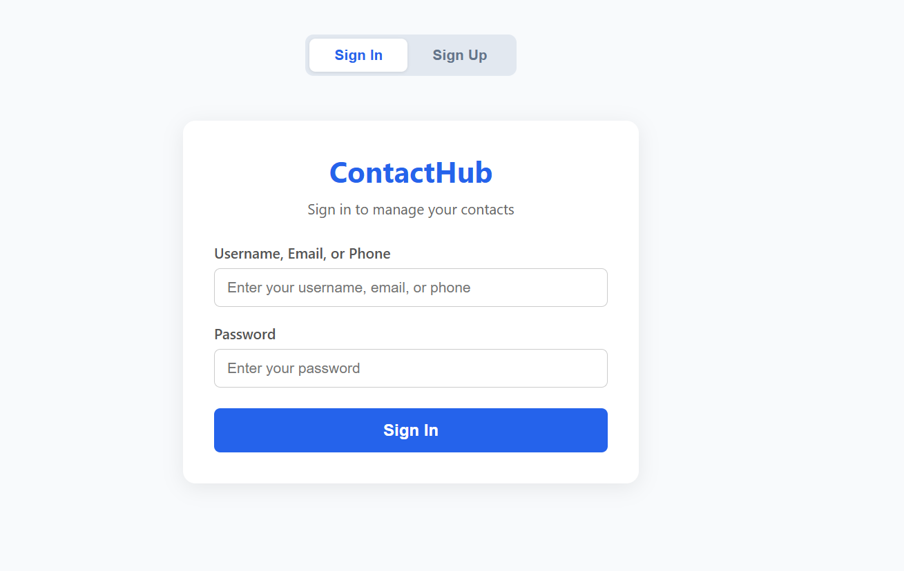
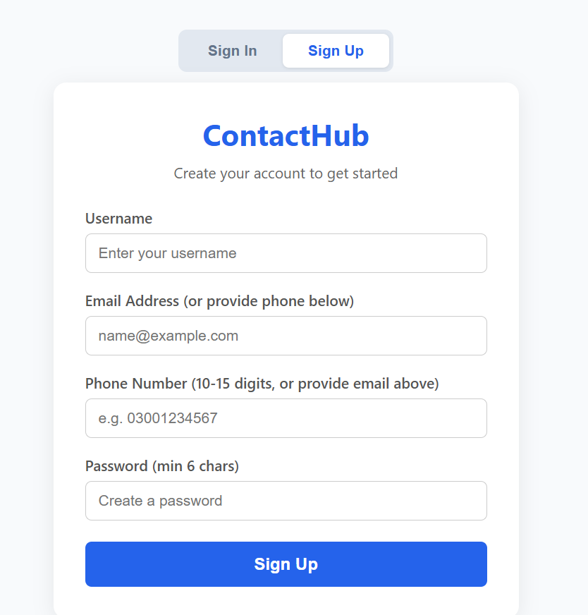
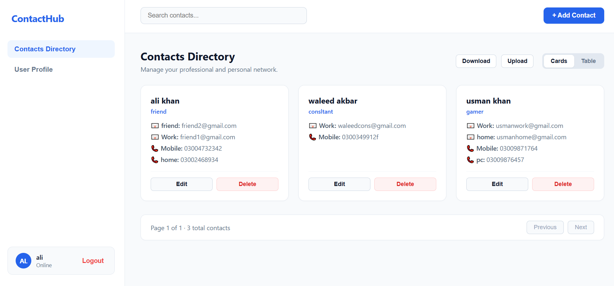
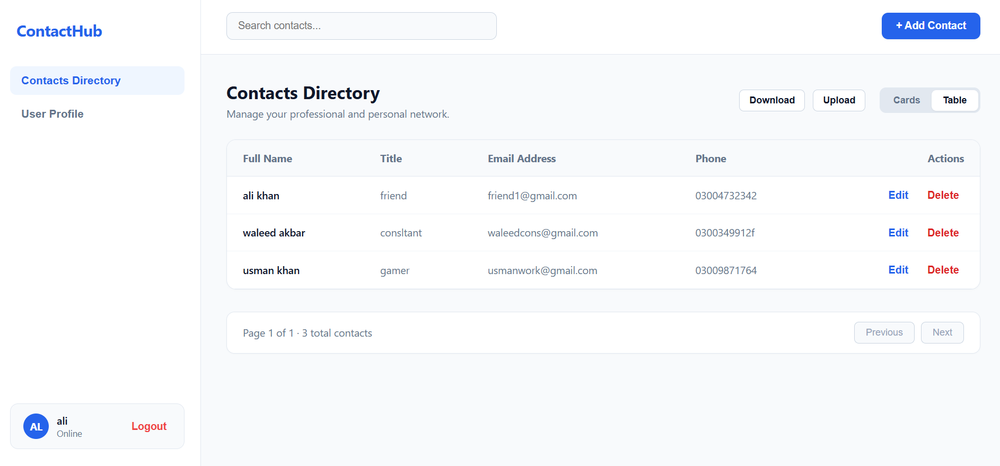
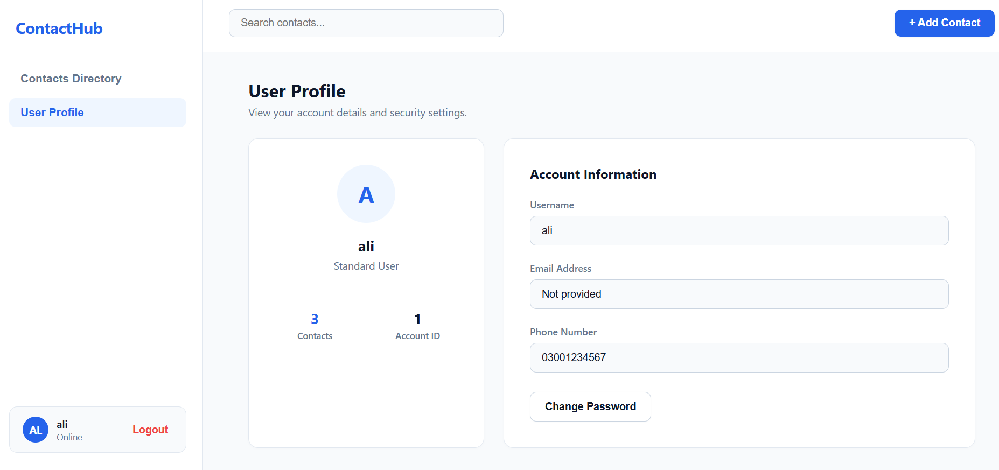
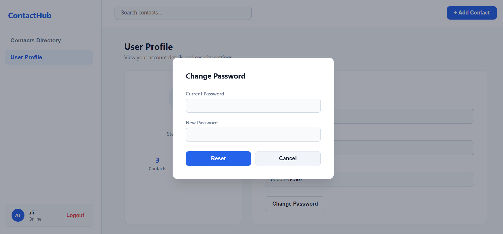

# ContactHub — Contact Management System

A full-stack contact management application built with **Java Spring Boot** and **React.js**, developed as part of the 10 Pearls Java Fullstack (Java + ReactJS) project track. The system allows users to securely register, authenticate, and manage a personal, paginated, searchable directory of contacts — each with multiple labeled email addresses and phone numbers.

---

## Table of Contents

1. [Overview](#overview)
2. [System Architecture](#system-architecture)
3. [Tech Stack](#tech-stack)
4. [Key Features](#key-features)
5. [Project Structure](#project-structure)
6. [Data Model](#data-model)
7. [API Reference](#api-reference)
8. [Security Design](#security-design)
9. [Getting Started](#getting-started)
10. [Environment Variables](#environment-variables)
11. [Running the Application](#running-the-application)
12. [Running Tests](#running-tests)
13. [Code Quality — SonarQube](#code-quality--sonarqube)
14. [Screenshots](#screenshots)
15. [Known Limitations](#known-limitations)

---

## Overview

ContactHub lets a user:
- Self-register using **either an email address or a phone number** (not necessarily both), plus a username and password
- Log in using their **username, email, or phone number** interchangeably
- View, create, update, delete, and search their own contacts in a paginated directory
- Give each contact **multiple labeled email addresses and phone numbers** (e.g. Work, Personal, Home, Mobile — not limited to one of each)
- Export their contacts to a file and re-import them later
- Change their password at any time, with old-password verification
- View and manage their own account profile

Every contact is scoped to the logged-in user — no user can view, edit, or delete another user's contacts, enforced at the service layer on every operation.

---

## System Architecture

```
┌─────────────────────┐         HTTPS / JSON          ┌──────────────────────┐
│   React Frontend      │  ─────────────────────────▶  │   Spring Boot Backend  │
│   (localhost:3000)    │  ◀─────────────────────────  │   (localhost:8080)     │
│                        │        JWT Bearer Token       │                        │
└─────────────────────┘                                └──────────┬───────────┘
                                                                    │
                                                                    │ Spring Data JPA
                                                                    ▼
                                                         ┌──────────────────────┐
                                                         │     SQL Server DB      │
                                                         │   (contact_manager)    │
                                                         └──────────────────────┘
```

**Request flow (authenticated request):**
1. React sends a request with `Authorization: Bearer <JWT>` header
2. `JwtAuthFilter` intercepts the request, validates the token via `JwtUtil`, and loads the user via `UserDetailsServiceImpl`
3. Spring Security's `SecurityContext` is populated, allowing the request to proceed to the controller
4. Controller delegates to the service layer, which enforces per-user ownership checks before touching the database
5. `GlobalExceptionHandler` catches any exception thrown anywhere in this chain and converts it into a structured JSON error response

---

## Tech Stack

### Backend
| Component | Technology |
|---|---|
| Language | Java 21 |
| Framework | Spring Boot 4.0.7 |
| Data Access | Spring Data JPA / Hibernate |
| Security | Spring Security + JWT (jjwt 0.12.6) |
| Database | Microsoft SQL Server (dev/prod), H2 in-memory (test) |
| Validation | Jakarta Bean Validation (`spring-boot-starter-validation`) |
| Logging | Slf4j + Logback |
| Testing | JUnit 5 + Mockito |
| Build Tool | Maven |
| Code Quality | SonarQube / SonarCloud |

### Frontend
| Component | Technology |
|---|---|
| Library | React.js (Create React App) |
| HTTP Client | Native `fetch` API |
| State Management | React hooks (`useState`, `useEffect`, `useCallback`) |
| Styling | Inline styles (no external UI framework) |

### DevOps
| Component | Technology |
|---|---|
| Version Control | Git / GitHub |
| CI | GitHub Actions |
| Static Analysis | SonarCloud (Java + JavaScript) |

---

## Key Features

### 🔐 Authentication & Authorization
- Self-registration using **email OR phone number** (at least one required, both optional individually)
- Login using **username, email, or phone number** interchangeably
- Passwords hashed with BCrypt — never stored or logged in plaintext
- Stateless authentication via JWT (24-hour expiry, configurable)
- Change password at any time, with mandatory old-password verification

### 📇 Contact Management
- Paginated contact listing (page/size configurable)
- Search/filter by first name or last name (case-insensitive, partial match)
- Create, update, delete contacts — all scoped to the authenticated user
- Each contact supports:
  - First Name, Last Name (required)
  - Title
  - **Multiple labeled email addresses** (e.g. Work, Personal — user-defined labels)
  - **Multiple labeled phone numbers** (e.g. Mobile, Home — user-defined labels)
- Export all contacts to a downloadable `.txt` file
- Import contacts from a previously exported file, with duplicate detection by email

### 🛡️ Error Handling & Logging
- Centralized exception handling (`GlobalExceptionHandler`) — every error returns structured JSON with a clear message, not a raw stack trace
- Field-level validation errors surfaced individually (e.g. "Password must be at least 6 characters")
- Application-wide Slf4j logging of key events (registration, login, contact CRUD, password changes) and errors

### ✅ Testing
- Unit and integration tests across controllers, services, and repositories
- Mockito-based isolation for service-layer logic
- `@SpringBootTest` + H2 in-memory database for repository-level integration tests

---

## Project Structure

```
cohort-9-java-12377-areeb/
├── .github/
│   └── workflows/
│       └── build.yml              # CI: builds backend, runs SonarQube (Java + JS)
├── backend/
│   ├── src/
│   │   ├── main/
│   │   │   ├── java/com/areeb/backend/
│   │   │   │   ├── config/         # SecurityConfig
│   │   │   │   ├── controller/     # AuthController, ContactController, UserController
│   │   │   │   ├── dto/            # Request/response DTOs
│   │   │   │   ├── exception/      # Custom exceptions + GlobalExceptionHandler
│   │   │   │   ├── model/          # JPA entities: User, Contact
│   │   │   │   ├── repository/     # Spring Data JPA repositories
│   │   │   │   ├── security/       # JwtUtil, JwtAuthFilter, UserDetailsServiceImpl
│   │   │   │   ├── service/        # Business logic layer
│   │   │   │   └── BackendApplication.java
│   │   │   └── resources/
│   │   │       ├── application.yaml
│   │   │       ├── application-dev.yaml
│   │   │       └── application-test.yaml
│   │   └── test/java/com/areeb/backend/   # Unit & integration tests
│   └── pom.xml
├── frontend/
│   ├── src/
│   │   ├── components/
│   │   │   ├── Login.jsx
│   │   │   ├── Register.jsx
│   │   │   ├── Dashboard.jsx
│   │   │   ├── ContactCard.jsx
│   │   │   ├── UserProfile.jsx
│   │   │   └── fileUtils.js        # export/import helpers
│   │   ├── services/
│   │   │   └── api.js              # all backend API calls
│   │   └── App.js
│   └── package.json
└── sonar-project.properties
```

---

## Data Model

### `User`
| Field | Type | Constraints |
|---|---|---|
| id | Long | PK, auto-generated |
| username | String | unique, not null |
| email | String | unique, **nullable** |
| phoneNumber | String | unique, **nullable** |
| password | String | not null (BCrypt hash) |

> Exactly one of `email` / `phoneNumber` must be provided at registration (enforced in `AuthService`), but at the database level both are nullable since only one is guaranteed.

### `Contact`
| Field | Type | Constraints |
|---|---|---|
| id | Long | PK, auto-generated |
| firstName | String | not null |
| lastName | String | not null |
| title | String | optional |
| emails | Map\<String, String\> | label → email address, stored via `@ElementCollection` |
| phoneNumbers | Map\<String, String\> | label → phone number, stored via `@ElementCollection` |
| user | User | `@ManyToOne`, owning relationship |

---

## API Reference

Base URL: `http://localhost:8080/api`

### Auth (public)
| Method | Endpoint | Description |
|---|---|---|
| POST | `/auth/register` | Register with username, password, and email and/or phone |
| POST | `/auth/login` | Login with `usernameOrEmailOrPhone` + password |

### User (authenticated)
| Method | Endpoint | Description |
|---|---|---|
| GET | `/users/me` | Get current user's profile |
| PUT | `/users/change-password` | Change password (requires old password) |

### Contacts (authenticated)
| Method | Endpoint | Description |
|---|---|---|
| GET | `/contacts?page=0&size=10` | Paginated contact list |
| GET | `/contacts/search?query=...&page=0&size=10` | Search by first/last name |
| GET | `/contacts/{id}` | Get single contact |
| POST | `/contacts` | Create a contact |
| PUT | `/contacts/{id}` | Update a contact |
| DELETE | `/contacts/{id}` | Delete a contact |
| GET | `/contacts/export` | Export all contacts as JSON |
| POST | `/contacts/import` | Import contacts from JSON |

All authenticated endpoints require an `Authorization: Bearer <token>` header, obtained from the login/register response.

---

## Security Design

- **Password storage**: BCrypt, one-way hash — never reversible, never logged
- **JWT**: signed with HMAC-SHA (secret loaded from `${jwt.secret}`, never hardcoded), stateless — no server-side session store
- **Ownership enforcement**: every contact operation checks `contact.getUser().getId().equals(userId)` before allowing access, returning `403 Forbidden` on mismatch
- **CORS**: restricted to `localhost:3000` / `localhost:5173` (React dev servers)
- **Validation**: all request DTOs validated via Jakarta Bean Validation before reaching business logic

---

## Getting Started

### Prerequisites
- Java 21 JDK
- Node.js (v18+) and npm
- Microsoft SQL Server (local instance, e.g. SQL Server Express)
- Maven (or use the included `mvnw` wrapper — no separate install needed)
- Git

### Clone the repository
```bash
git clone https://github.com/mlkareeb/cohort-9-java-12377-areeb.git
cd cohort-9-java-12377-areeb
```

---

## Environment Variables

The backend requires the following environment variables to be set before starting (used by the `dev` Spring profile):

| Variable | Description | Example |
|---|---|---|
| `DB_USERNAME` | SQL Server login username | `mlkareeb` |
| `DB_PASSWORD` | SQL Server login password | `contact123` |
| `JWT_SECRET` | Secret key used to sign JWTs (Base64 string recommended) | `404E635266556A586E3272357538782F413F4428472B4B6250645367566B5970` |
| `SPRING_PROFILES_ACTIVE` | Active Spring profile | `dev` |

### Setting them (PowerShell example)
```powershell
$env:DB_USERNAME="your_db_username"
$env:DB_PASSWORD="your_db_password"
$env:JWT_SECRET="your_jwt_secret"
$env:SPRING_PROFILES_ACTIVE="dev"
```

### Database setup
1. Ensure SQL Server is running locally on port `1433`
2. Create a database named `contact_manager` (the schema itself — tables, columns — is created automatically by Hibernate on first run via `ddl-auto: update`)

```sql
CREATE DATABASE contact_manager;
```

---

## Running the Application

### Backend
```powershell
cd backend
$env:DB_USERNAME="your_db_username"
$env:DB_PASSWORD="your_db_password"
$env:JWT_SECRET="your_jwt_secret"
$env:SPRING_PROFILES_ACTIVE="dev"
.\mvnw spring-boot:run
```
The backend starts on **http://localhost:8080**.

### Frontend
In a separate terminal:
```bash
cd frontend
npm install
npm start
```
The frontend starts on **http://localhost:3000** and communicates with the backend automatically (base URL configured in `src/services/api.js`, overridable via `REACT_APP_API_BASE_URL`).

### Using the app
1. Open `http://localhost:3000`
2. Click **Sign Up**, register with a username, password, and either an email or a phone number
3. You're logged in automatically and redirected to the Contacts Directory
4. Use **+ Add Contact** to create a contact with one or more labeled emails/phone numbers
5. Use the search bar, **Download**/**Upload** buttons, and **Cards**/**Table** toggle to manage your directory
6. Visit **User Profile** to view your account details or change your password

---

## Running Tests

### Backend
```bash
cd backend
.\mvnw test
```
Runs the full JUnit/Mockito suite — unit tests for services and controllers, and integration tests (via `@SpringBootTest` + H2) for repositories and the application context.

To run the full build including tests:
```bash
.\mvnw clean install
```

### Frontend
```bash
cd frontend
npm test
```

---

## Code Quality — SonarQube

Static analysis runs automatically via GitHub Actions on every push to `main` / `feature/*` branches and on pull requests, analyzing **both the Java backend and the JavaScript/React frontend**.

- Workflow: `.github/workflows/build.yml`
- Configuration: `sonar-project.properties` (frontend scan) + Maven Sonar plugin (backend scan)
- Dashboard: [SonarCloud project](https://sonarcloud.io/project/overview?id=mlkareeb_cohort-9-java-12377-areeb)

To run analysis locally, a `SONAR_TOKEN` must be available as an environment variable or GitHub Actions secret.

---

## Screenshots

### Sign In
Login accepts a **username, email, or phone number** interchangeably.



### Sign Up
Registration requires a username and password, plus **either** an email or a phone number (not both mandatory).



### Contacts Directory — Cards View
Each contact can carry multiple labeled emails and phone numbers (e.g. `friend`, `Work`, `Mobile`, `home`), all displayed on the card.



### Contacts Directory — Table View
The same directory, toggled to a compact table layout with paginated results.



### User Profile
Displays real account data pulled from the backend — username, email (or "Not provided" if registered by phone), phone number, and total contact count.



### Change Password
Requires the current password before allowing a reset.



---

## Known Limitations

- A contact cannot hold two entries under the **same** label (e.g. two emails both labeled "Work") — the label acts as a unique key per contact. Distinct labels (e.g. "Work" and "Work 2") work without limit.
- New-password-equals-old-password is accepted silently on password change (not rejected) — not a requirement violation, just a UX nicety not currently implemented.
- Export/Import currently round-trips via a custom `.txt` format rather than a standard format like CSV/vCard.
- A contact's labeled phone number values are not format-validated (unlike the phone number supplied at registration, which is) — any string is accepted.

---

## Author

Built by **Areeb** as part of the 10 Pearls Java Fullstack (Java + ReactJS) training program.
